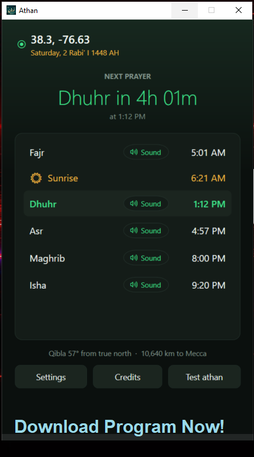
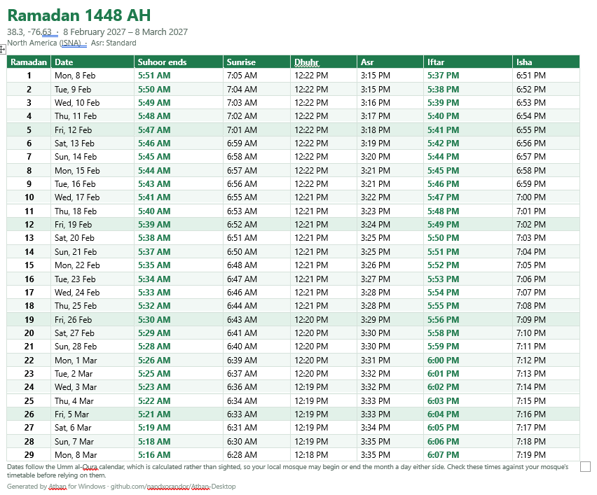
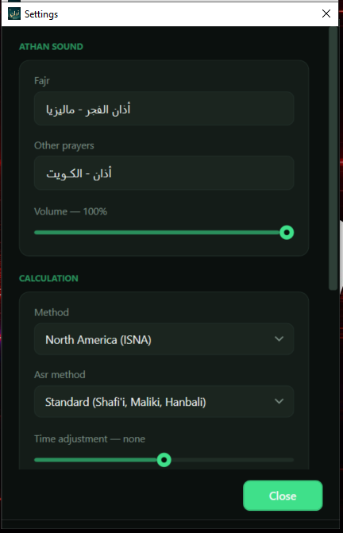
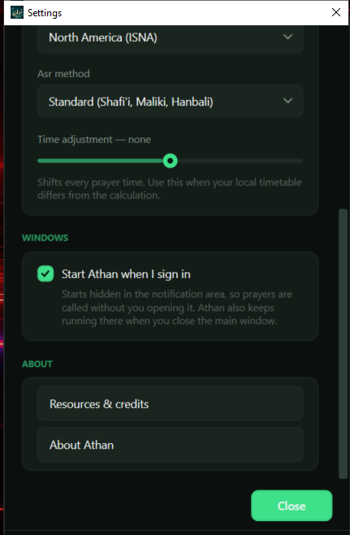
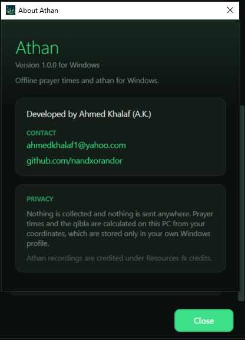
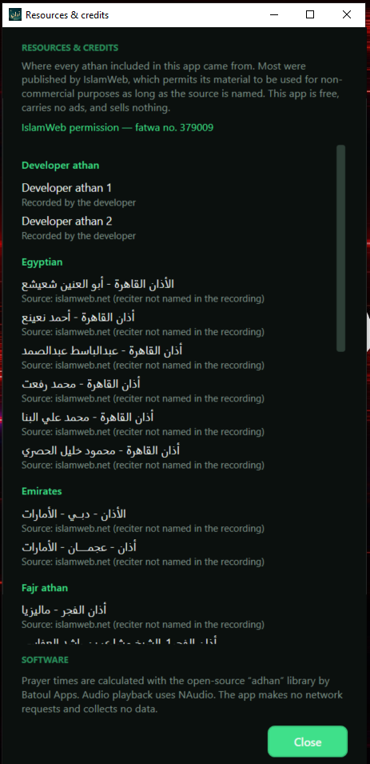
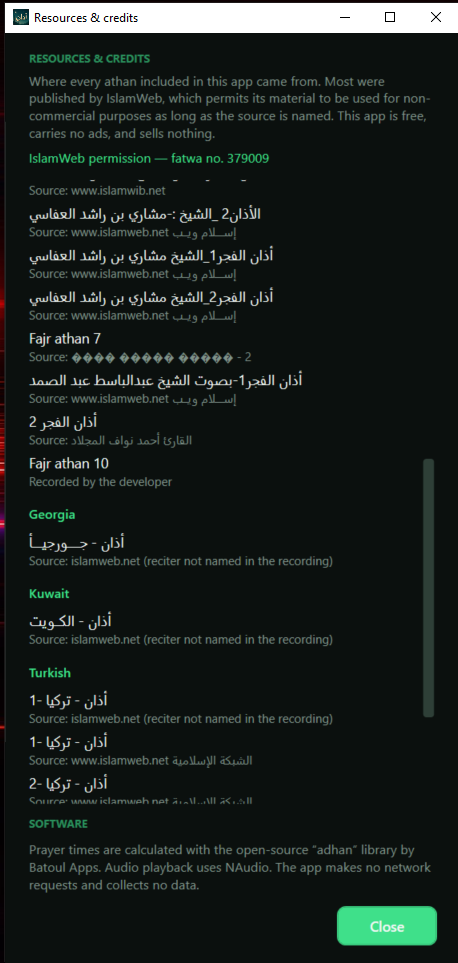
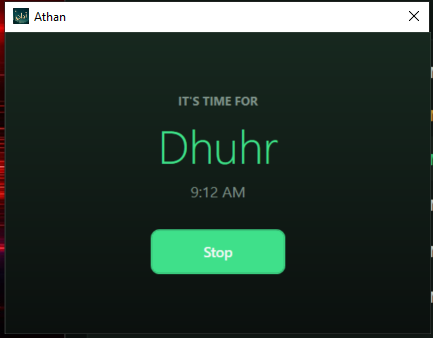

<h1 align="center">Athan for Windows</h1>

<p align="center">
  <b>Offline prayer times and the athan, on your PC.</b><br>
  One file. No installer, no account, no ads, no tracking, no network calls.
</p>

<p align="center">
  <a href="../../releases/latest"></a>
  
  
</p>

<p align="center">
  <a href="https://github.com/nandxorandor/Athan-Desktop/releases/latest/download/Athan.exe">
    
  </a>
</p>

<p align="center"><sub><b>Click the image to download.</b> One file, nothing to install.</sub></p>

---

<div dir="rtl" align="right">

## نبذة عن التطبيق

**آذان لويندوز** تطبيق مجاني خفيف لمواقيت الصلاة على الحاسوب، يعمل بالكامل على جهازك دون حاجة إلى إنترنت أو حساب. لا إعلانات فيه، ولا يجمع أي بيانات، ولا يرسل شيئًا إلى أي خادم. وهو رفيق [تطبيق آذان لأندرويد](https://github.com/nandxorandor/Athan): المكتبة الحسابية نفسها والتسجيلات نفسها، فتتطابق المواقيت بين الجهازين إلى الدقيقة.

**ملف واحد فقط.** نزّل `Athan.exe` وشغّله؛ لا تنصيب ولا فكّ ضغط — فبيئة التشغيل والتسجيلات التسعة والعشرون كلّها بداخل الملف نفسه.

### ما الذي يقدّمه

- **مواقيت الصلاة دون إنترنت** — تُحسب على الجهاز نفسه اعتمادًا على إحداثيات موقعك، مع إمكانية اختيار طريقة الحساب والمذهب، وتعديل يدوي حتى 120 دقيقة زيادةً أو نقصًا إن اختلف توقيت مسجدك المحلي عن الحساب.
- **الأذان في وقته** — تظهر نافذة لا تُخطئها العين، وفيها زرّ إيقاف واحد لا غير.
- **ثلاثة أوضاع لكل صلاة**، تُبدَّل بنقرة على سطر الصلاة: **صوت** (نافذة وتسجيل)، و**تنبيه** (نافذة بلا صوت)، و**صامت** (لا شيء).
- **يعمل في شريط الإشعارات** — إغلاق النافذة لا يُنهي التطبيق، بل يبقى منتظرًا الصلاة التالية. ويبدأ مع تشغيل ويندوز تلقائيًا، ويمكنك تعطيل ذلك من الإعدادات.
- **تقويم رمضان** — جدول لشهر رمضان كاملًا: يوم الصيام، والتاريخ، ونهاية السحور، والشروق، والظهر، والعصر، والإفطار، والعشاء. يُحفَظ ملفَّ وورد (`.docx`) مُهيَّأً ليُطبع **في صفحة واحدة**، أو ملفَّ جدول بيانات (`.csv`). ويعرض التطبيق نفسه عليك تلقائيًا في الأسبوعين السابقين لأول يوم من رمضان، مرّةً واحدة لا غير، ويمكن تعطيل ذلك من الإعدادات.
- **اتجاه القبلة** بالدرجات من موقعك، مع المسافة إلى مكة.
- **التاريخ الهجري** من تقويم أم القرى المضمَّن في ويندوز.

### تحديد الموقع

ثلاث طرق: **«تحديد موقعي»** يسأل ويندوز عن موقع الجهاز ويعمل في أي مكان في العالم (يتطلّب تفعيل خدمة الموقع في إعدادات ويندوز)، أو اختيار مدينة من القائمة المضمَّنة، أو إدخال خطّي الطول والعرض مباشرةً لأي مكان لا تبلغه القائمة. وفي كل الأحوال تُحفظ الإحداثيات في ملفّك الشخصي على الجهاز وحده ولا تغادره.

### عن تسجيلات الأذان

يضمّ التطبيق 29 تسجيلًا. ثلاثة منها بصوتي أنا، وبقيّتها ممّا نشره موقع **إسلام ويب**، وقد أذِن الموقع في [الفتوى رقم 379009](https://www.islamweb.net/en/fatwa/379009/) بالانتفاع بمواده لغير أغراض تجاريّة بشرط ذكر المصدر ونسبته إليه — والتطبيق مجاني بلا إعلانات ولا مبيعات، وكلّ تسجيل منسوب إلى قارئه ومصدره في شاشة «المصادر والشكر» داخل الإعدادات.

وما لم يُؤذن فيه لم أُضمّنه: تسجيلات الحرمين من بثّ التلفزيون السعودي ليست ملكًا لإسلام ويب حتى يأذن فيها، فتُركت خارج التطبيق.

### الخصوصية

لا يجمع التطبيق أي بيانات ولا يرسل شيئًا خارج الجهاز: لا تتبُّع، ولا إعلانات، ولا اتصال بالشبكة أصلًا. تُحفظ الإعدادات في `%APPDATA%\Athan` وحدها.

### التحميل والتثبيت

نزّل ملف `Athan.exe` من صفحة [الإصدارات](../../releases) وشغّله. سيُظهر ويندوز تحذير SmartScreen في أول مرة لأنّ الملف غير موقَّع بشهادة مدفوعة: اضغط **More info ← Run anyway**. ومعنى التحذير أنّ ويندوز لم يرَ هذا الملف من قبل، لا أنّه وجد فيه شيئًا. يتطلّب ويندوز 10 (إصدار 19041) فأحدث بنواة 64-بت، وحجمه نحو 105 ميجابايت.

</div>

---

## In English

The desktop companion to [Athan for Android](https://github.com/nandxorandor/Athan).
Same prayer-time library, same 29 bundled recordings, same credits — so the two
agree to the minute.

### What it does

- **Prayer times calculated offline**, with the [adhan](https://github.com/batoulapps/adhan-java)
  library. Calculation method and madhab are selectable, plus a ±120-minute
  manual adjustment when your local timetable differs.
- **Calls the athan at the right moment**, with a window you cannot miss and one
  Stop button.
- **Three modes per prayer**, clicked on the row itself:
  **Sound** (window and recording) · **Popup** (window only) · **Silent** (nothing).
- **Runs in the notification area.** Closing the window does not quit it; it
  keeps waiting for the next prayer. Starts with Windows by default, hidden in
  the tray — untick that in Settings if you would rather it did not.
- **Ramadan calendar** — the whole month as a table, saved as a **one-page**
  `.docx` to print, or a `.csv` for a spreadsheet. Offered automatically as
  Ramadan comes round.
- **Qibla bearing** from your coordinates, with the distance to Mecca.
- **Hijri date**, from the Umm al-Qura calendar Windows already ships.

## The Ramadan calendar

Ramadan is the one month people want every day's times at once, the night
before, rather than just today's. **Settings → Ramadan → Ramadan calendar…**
(also on the tray menu) shows the whole month — day of the fast, date, suhoor
ends, sunrise, Dhuhr, Asr, iftar, Isha, with Fridays shaded — and saves it as a
Word document laid out to land on **one page**, ready for the fridge door. A CSV
is there too if you would rather have it in a spreadsheet.

You do not have to remember it exists: in the fortnight before the first fast,
the app offers it once, and only once. Dismissing that offer silences it for
that year alone, not for good. The whole thing can be switched off in Settings.

Dates come from the Umm al-Qura calendar, which is calculated rather than
sighted, so your local mosque may begin or end the month a day either side —
the printout says so on it.

<p align="center">
  
</p>

<p align="center"><sub>The saved <code>.docx</code> — the whole month on one page, suhoor and iftar picked out, Fridays shaded.</sub></p>

## Screenshots

<p align="center">
  
  
  
</p>

<p align="center">
  
  
</p>

<p align="center"><sub>The credits screen is generated from the shipped audio index, so it cannot list a recording the app does not have.</sub></p>

<p align="center">
  
</p>

## Download

Grab `Athan.exe` from the [Releases](../../releases) page and run it. There is
nothing to install and nothing to unzip — the .NET runtime and all 29 recordings
are inside the one file.

Windows SmartScreen will warn you the first time, because the file is not signed
with a paid code-signing certificate. **More info → Run anyway.** That warning
means Windows has not seen this file before, not that it found anything in it.

Requires **Windows 10 (build 19041) or newer, 64-bit**. About 105 MB.

## Setting your location

Three ways, in the order most people will want them:

1. **Detect my location** — asks Windows where the PC is. Works anywhere in the
   world. Needs Location turned on in *Settings → Privacy & security → Location*,
   including for desktop apps.
2. **Pick a city** from the bundled list.
3. **Type coordinates** directly, for anywhere the list does not reach.

Whichever you use, the coordinates are stored only in your own Windows profile
and never leave the machine.

## Where your settings live

`%APPDATA%\Athan\settings.json` — deliberately not next to the exe, so you can
move `Athan.exe` anywhere without losing your location or sound choices.

If you enable "start when I sign in", that is an ordinary `Run` entry under
`HKCU\Software\Microsoft\Windows\CurrentVersion\Run`, visible and removable in
Task Manager's Startup tab. It stores the exe's path, so run Athan once from its
new home if you move it.

## About the recordings

29 athans are bundled. Three are the author's own; the rest were published by
**IslamWeb**, which permits its material to be used for non-commercial purposes
as long as the source is named ([fatwa no. 379009](https://www.islamweb.net/en/fatwa/379009/)).
This app is free, carries no ads and sells nothing. Every recording is credited
to its reciter and source under **Settings → Resources & credits**, generated
from the shipped audio index so it cannot drift out of step with what is in the
file.

The Mecca and Madina recordings are deliberately **not** included: those are
Saudi state broadcasts, which IslamWeb hosts but does not own, so its permission
does not extend to them.

## Privacy

No analytics, no crash reporter, no ad network, no network requests at all.
Prayer times and the qibla are astronomy, computed on your machine.

## Building from source

```powershell
cd AthanDesktop
dotnet publish -c Release -r win-x64 --self-contained true -o ..\dist
```

Needs the **.NET 9 SDK**. The result is a single `dist\Athan.exe`.

The recordings under `AthanDesktop\Assets\athan\` are copied from the Android
app's assets, index and all, so both platforms ship the same catalogue.

## Differences from the Android app

| | Android | Windows |
|---|---|---|
| Qibla | live compass | bearing in degrees (a PC has no magnetometer) |
| Vibrate mode | yes | replaced by **Popup** — window, no sound |
| Pre-prayer heads-up | yes | not yet |
| Downloaded athans | browse and import | pick any MP3 on the PC |
| Ramadan calendar | — | one-page `.docx` or `.csv`, offered each Ramadan |

## Licence

**Source code:** [MIT](LICENSE).

**Audio** — not covered by the MIT licence. The three `Developer_Athan-*`
recordings are the author's, under CC BY 4.0. Everything else remains the
property of its reciters and of IslamWeb, is included under their
non-commercial-with-attribution terms, and is **not** relicensed here. If you
fork this repo, either honour those terms or delete the files.

## Contact

Ahmed Khalaf — ahmedkhalaf1@yahoo.com · [github.com/nandxorandor](https://github.com/nandxorandor)
